# 🔌 Diagrama de Flujo - api.py

## Flujo de la API FastAPI

```mermaid
graph TD
    A["Inicio: Inicialización FastAPI"] --> B["Configurar logging"]
    B --> C["Crear aplicación FastAPI"]
    C --> D["Montar directorio estático"]
    D --> E["Definir modelo ChartRequest"]
    E --> F["Crear endpoint /generate-chart/"]
    E --> G["Crear endpoint / (health check)"]
    
    H["Solicitud POST /generate-chart/"] --> I["Validar modelo ChartRequest"]
    I --> J["Registrar solicitud recibida"]
    J --> K["Llamar a workflow.run_workflow()"]
    K --> L{"¿La ejecución fue exitosa?"}
    L -->|No| M["Registrar error y lanzar excepción"]
    L -->|Sí| N["Convertir rutas a URLs públicas"]
    N --> O["Calcular tiempo de procesamiento"]
    O --> P["Registrar éxito y retornar resultados"]
    
    Q["Solicitud GET /"] --> R["Registrar health check"]
    R --> S["Retornar mensaje de estado"]
```



## Descripción del Flujo

### Inicialización de la API

1. **Inicio**: Se importa FastAPI y otros módulos necesarios
2. **Configurar logging**: Se establece el nivel de logging y se silencian loggers de terceros
3. **Crear aplicación**: Se inicializa la aplicación FastAPI con título, descripción y versión
4. **Montar directorio estático**: Se monta el directorio de gráficos como `/static` para acceso público
5. **Definir modelos**: Se define el modelo `ChartRequest` para validar las solicitudes
6. **Crear endpoints**: Se implementan los endpoints `/generate-chart/` y `/`

### Flujo del Endpoint /generate-chart/

1. **Solicitud POST**: Se recibe una solicitud al endpoint `/generate-chart/`
2. **Validar modelo**: FastAPI valida automáticamente el cuerpo contra el modelo `ChartRequest`
3. **Registrar solicitud**: Se registra la instrucción recibida para seguimiento
4. **Llamar workflow**: Se invoca a [`workflow.run_workflow()`](../src/main.py:21) con los parámetros adecuados
5. **Verificar ejecución**: Se comprueba si el workflow se ejecutó correctamente
6. **Convertir rutas**: Se convierten las rutas locales de los gráficos en URLs públicas
7. **Calcular tiempo**: Se mide y registra el tiempo total de procesamiento
8. **Retornar resultados**: Se devuelve un diccionario con los resultados del workflow

### Flujo del Endpoint / (Health Check)

1. **Solicitud GET**: Se recibe una solicitud al endpoint raíz
2. **Registrar acceso**: Se registra que se accedió al endpoint de health check
3. **Retornar mensaje**: Se devuelve un mensaje JSON confirmando que la API está en línea

## Puntos Clave del Diseño

- **Arquitectura RESTful**: La API sigue los principios REST para el diseño de endpoints
- **Validación automática**: Se utiliza Pydantic para la validación automática de solicitudes
- **Logging estructurado**: Todas las operaciones importantes se registran para seguimiento
- **Manejo de errores**: Se implementan try-catch para el manejo robusto de excepciones
- **Servicio de archivos estáticos**: Los gráficos generados se sirven a través de un endpoint estático

## Modelo de Datos

### ChartRequest
```python
class ChartRequest(BaseModel):
    instruction: str
```

Este modelo asegura que todas las solicitudes al endpoint `/generate-chart/` incluyan una instrucción en formato string.

## Respuesta de la API

La API retorna un diccionario con la siguiente estructura:

```python
{
    "status": "Completed|Error en V1|Error en V2",
    "v1_success": True|False,
    "chart_v1_path": "ruta/local/grafico_v1.png",
    "chart_v1_url": "/static/grafico_v1.png",
    "feedback": "texto del feedback",
    "v2_success": True|False,
    "chart_v2_path": "ruta/local/grafico_v2.png",
    "chart_v2_url": "/static/grafico_v2.png"
}
```

## Relación con Otros Módulos

El [`api.py`](../src/api.py) depende de:

- [`fastapi`](../src/api.py:2): Framework web para crear la API
- [`fastapi.staticfiles`](../src/api.py:3): Para servir archivos estáticos
- [`pydantic`](../src/api.py:4): Para la validación de modelos de datos
- [`main as workflow`](../src/api.py:10): Para ejecutar el workflow principal
- [`config`](../src/api.py:11): Para obtener configuración de rutas y modelos

## Uso de la API

La API se puede utilizar de varias formas:

### 1. Con curl
```bash
curl -X POST "http://localhost:8000/generate-chart/" \
  -H "Content-Type: application/json" \
  -d '{"instruction": "Visualiza la evolución mensual de ventas por región"}'
```

### 2. Con Python
```python
import requests

response = requests.post(
    "http://localhost:8000/generate-chart/",
    json={"instruction": "Compara ventas por trimestre"}
)
results = response.json()
```

### 3. Desde la interfaz web
La interfaz Gradio en [`interface.py`](../src/interface.py) utiliza esta API para generar gráficos.

## Configuración de Archivos Estáticos

La API monta el directorio de gráficos como estático:

```python
charts_directory = config.CHARTS_DIR
os.makedirs(charts_directory, exist_ok=True)
app.mount("/static", StaticFiles(directory=charts_directory), name="static")
```

Esto permite que los gráficos generados sean accesibles a través de URLs como:
- `http://localhost:8000/static/grafico_v1.png`
- `http://localhost:8000/static/grafico_v2.png`

## Manejo de Errores

La API implementa un manejo robusto de errores:

1. **Validación de solicitudes**: FastAPI valida automáticamente el formato de las solicitudes
2. **Excepciones en el workflow**: Si el workflow falla, se registra el error y se lanza una excepción
3. **Errores de conexión**: Se manejan errores de red o problemas con el servicio
4. **Logging detallado**: Todos los errores se registran con información de contexto para depuración