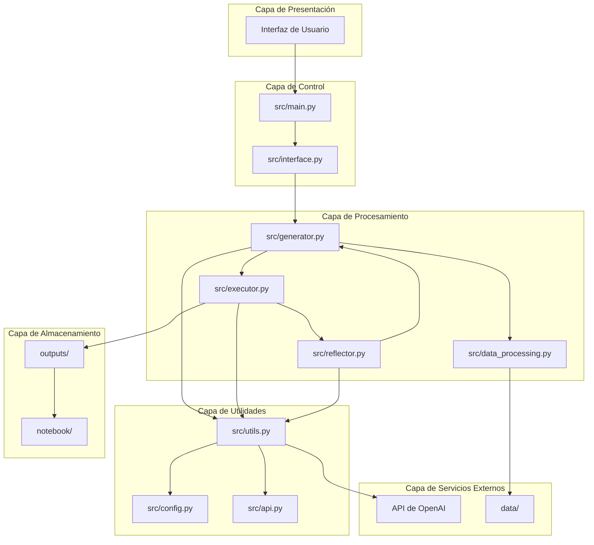

# 🏗️ Arquitectura del Proyecto

## Diagrama de Arquitectura General

## Descripción de Componentes

### Capa de Presentación
- **Interfaz de Usuario**: Punto de entrada para la interacción con el sistema.

### Capa de Control
- **main.py**: Orquestador principal del sistema, coordina el flujo de trabajo entre los diferentes componentes.
- **interface.py**: Maneja la interfaz de comunicación entre el usuario y el sistema.

### Capa de Procesamiento
- **generator.py**: Generador de código y soluciones basado en los requisitos y datos de entrada.
- **executor.py**: Ejecutor del código generado, responsable de ejecutar las operaciones y generar resultados.
- **reflector.py**: Analizador y refinador de resultados, proporciona feedback y mejora las soluciones generadas.
- **data_processing.py**: Módulo especializado en el procesamiento y transformación de datos.

### Capa de Servicios Externos
- **API de OpenAI**: Servicio externo utilizado para generación de texto y análisis de imágenes.
- **data/**: Directorio que contiene los datasets de entrada para el procesamiento.

### Capa de Utilidades
- **utils.py**: Módulo de utilidades que proporciona herramientas esenciales para la integración con APIs, manejo de datos y procesamiento de contenido.
- **config.py**: Módulo de configuración del sistema.
- **api.py**: Módulo que maneja las interacciones con APIs externas.

### Capa de Almacenamiento
- **outputs/**: Directorio que almacena los resultados generados por el sistema.
- **notebook/**: Directorio que contiene notebooks para análisis y documentación.

## Flujo de Trabajo Principal

1. **Inicio**: El usuario interactúa con el sistema a través de la interfaz de usuario.
2. **Coordinación**: El módulo `main.py` coordina el flujo de trabajo, iniciando el proceso a través de `interface.py`.
3. **Generación**: El `generator.py` utiliza los datos de entrada y las utilidades para generar soluciones iniciales.
4. **Ejecución**: El `executor.py` ejecuta el código generado, produciendo resultados.
5. **Reflexión**: El `reflector.py` analiza los resultados y proporciona feedback para mejorar las soluciones.
6. **Iteración**: El proceso se repite con el feedback del reflector para mejorar las soluciones generadas.
7. **Almacenamiento**: Los resultados finales se almacenan en el directorio `outputs/`.

## Integración con Servicios Externos

- **OpenAI API**: El sistema se integra con la API de OpenAI a través del módulo `utils.py` para:
  - Generación de texto mediante la función `get_response()`
  - Análisis de imágenes mediante la función `image_openai_call()`
  
- **Procesamiento de Datos**: El sistema procesa datasets almacenados en el directorio `data/` mediante el módulo `data_processing.py`.

## Dependencias entre Componentes

- **utils.py**: Es un módulo central utilizado por casi todos los demás componentes, proporcionando funcionalidades esenciales como:
  - Codificación/decodificación de imágenes
  - Comunicación con APIs
  - Procesamiento de texto
  - Manejo de datos

- **generator.py**, **executor.py**, **reflector.py**: Forman un ciclo iterativo de generación-ejecución-reflexión que permite mejorar continuamente las soluciones.

- **main.py**: Actúa como orquestador, coordinando la interacción entre todos los componentes.

## Patrones de Diseño Utilizados

1. **Patrón de Iteración Refinada**: El sistema sigue un ciclo de generación-ejecución-reflexión para mejorar continuamente las soluciones.
2. **Patrón de Modularidad**: Cada componente tiene una responsabilidad única y bien definida.
3. **Patrón de Inyección de Dependencias**: Los componentes utilizan utilidades y servicios externos a través de interfaces bien definidas.
4. **Patrón de Pipeline**: El flujo de trabajo sigue una estructura de pipeline donde cada etapa procesa y pasa datos a la siguiente.