# 📊 Diagrama de Flujo - data_processing.py

## Flujo de Procesamiento de Datos

```mermaid
graph TD
    A["Inicio: load_configured_data()"] --> B{"¿Usar MongoDB? (USE_MONGO_DB)"}
    B -->|Sí| C["Verificar configuración MongoDB"]
    B -->|No| D["Verificar configuración CSV"]
    
    C --> E{"¿Configuración completa?"}
    E -->|No| F["Registrar error y retornar None"]
    E -->|Sí| G["Llamar a load_and_prepare_data_from_mongo()"]
    
    D --> H{"¿Existe archivo CSV?"}
    H -->|No| I["Registrar error y retornar None"]
    H -->|Sí| J["Llamar a load_and_prepare_data()"]
    
    G --> K["Conectar a MongoDB"]
    K --> L["Leer datos de colección"]
    L --> M["Procesar fechas (si existe columna 'date')"]
    M --> N["Eliminar columna '_id'"]
    N --> O["Cerrar conexión"]
    O --> P["Retornar DataFrame"]
    
    J --> Q["Leer archivo CSV"]
    Q --> R["Procesar fechas (si existe columna 'date')"]
    R --> S["Retornar DataFrame"]
    
    F --> T["Retornar None"]
    I --> T
```



## Descripción del Flujo

### Flujo Principal

1. **Inicio**: Se llama a la función [`load_configured_data()`](../src/data_processing.py:16)
2. **Decisión de fuente de datos**: Se verifica el valor de `config.USE_MONGO_DB`
3. **Ruta MongoDB**: Si se usa MongoDB, se verifica la configuración y se cargan los datos desde la base de datos
4. **Ruta CSV**: Si se usa CSV, se verifica que el archivo exista y se cargan los datos desde el archivo
5. **Procesamiento de fechas**: En ambos casos, si existe una columna 'date', se procesa para extraer quarter, month y year
6. **Retorno de datos**: Se retorna el DataFrame procesado o None si hubo errores

### Flujo MongoDB

1. **Verificar configuración**: Se comprueba que existan MONGO_URI, MONGO_DB_NAME y MONGO_COLLECTION_NAME
2. **Conectar a MongoDB**: Se establece la conexión con la base de datos
3. **Leer datos**: Se leen todos los documentos de la colección especificada
4. **Procesar fechas**: Si existe columna 'date', se convierte a datetime y se extraen componentes
5. **Eliminar _id**: Se elimina la columna '_id' agregada por MongoDB
6. **Cerrar conexión**: Se cierra la conexión a la base de datos
7. **Retornar DataFrame**: Se retorna el DataFrame procesado

### Flujo CSV

1. **Verificar archivo**: Se comprueba que exista el archivo CSV en la ruta configurada
2. **Leer CSV**: Se carga el archivo CSV en un DataFrame
3. **Procesar fechas**: Si existe columna 'date', se convierte a datetime y se extraen componentes
4. **Retornar DataFrame**: Se retorna el DataFrame procesado

## Puntos Clave del Diseño

- **Flexibilidad**: Soporta dos fuentes de datos diferentes (MongoDB y CSV)
- **Procesamiento automático de fechas**: Si existe una columna 'date', se procesa automáticamente
- **Manejo robusto de errores**: Se verifican todas las condiciones y se registran los errores
- **Gestión de recursos**: Las conexiones a MongoDB se cierran adecuadamente
- **Consistencia**: Ambas rutas de carga aplican el mismo procesamiento de fechas

## Procesamiento de Fechas

Cuando existe una columna 'date', se realiza el siguiente procesamiento:

```python
df["date"] = pd.to_datetime(df["date"], errors="coerce")
df["quarter"] = df["date"].dt.quarter
df["month"] = df["date"].dt.month
df["year"] = df["date"].dt.year
```

Este procesamiento:
- Convierte la columna a formato datetime
- Extrae el trimestre (1-4)
- Extrae el mes (1-12)
- Extrae el año
- Maneja errores de conversión con `errors="coerce"`

## Manejo de Errores

El módulo implementa un manejo robusto de errores:

### Errores de MongoDB
- Configuración incompleta (falta MONGO_URI, MONGO_DB_NAME o MONGO_COLLECTION_NAME)
- Errores de conexión a la base de datos
- Errores al leer datos de la colección

### Errores de CSV
- Archivo no encontrado en la ruta especificada
- DATA_FILENAME no definido en la configuración

### Registro de Errores

Todos los errores se registran mediante logging con información detallada:

```python
logger.error("Lumina Data Error: MongoDB configuration missing...")
logger.error(f"Lumina Data Error: CSV file not found at {csv_path}...")
logger.error(f"Lumina Data Error: Failed to connect or read from MongoDB: {e}...")
```

## Relación con Otros Módulos

El [`data_processing.py`](../src/data_processing.py) depende de:

- [`os`](../src/data_processing.py:6): Para acceder a variables de entorno
- [`logging`](../src/data_processing.py:7): Para el registro de eventos
- [`pandas`](../src/data_processing.py:8): Para el manejo de DataFrames
- [`pymongo.MongoClient`](../src/data_processing.py:9): Para la conexión a MongoDB
- [`config`](../src/data_processing.py:10): Para acceder a la configuración del proyecto

## Uso del Módulo

El módulo se utiliza principalmente desde [`main.py`](../src/main.py) de la siguiente manera:

```python
df = data_processing.load_configured_data()

if df is None or df.empty:
    logger.error("Lumina Workflow Error: No data loaded...")
    return {"status": "Error", "message": "No se pudieron cargar los datos."}
```

## Variables de Entorno Requeridas

### Para MongoDB (cuando USE_MONGO_DB = True)
- `MONGO_URI`: URI de conexión a MongoDB
- `MONGO_DB_NAME`: Nombre de la base de datos
- `MONGO_COLLECTION_NAME`: Nombre de la colección

### Para CSV (cuando USE_MONGO_DB = False)
- `DATA_FILENAME`: Nombre del archivo CSV (definido en config.py)

## Salida Esperada

La función principal retorna:

- **pd.DataFrame**: Si los datos se cargaron y procesaron correctamente
- **None**: Si ocurrió algún error durante el proceso

El DataFrame retornado incluye:
- Todas las columnas originales del archivo o colección
- Columnas adicionales de procesamiento de fechas (si existía columna 'date'):
  - `quarter`: Trimestre (1-4)
  - `month`: Mes (1-12)
  - `year`: Año

## Buenas Prácticas Implementadas

1. **Gestión de conexiones**: Las conexiones a MongoDB se cierran en un bloque `finally`
2. **Validación de datos**: Se verifica la existencia de archivos y configuración antes de operar
3. **Procesamiento consistente**: Ambas fuentes de datos reciben el mismo procesamiento de fechas
4. **Logging detallado**: Todas las operaciones importantes se registran para seguimiento
5. **Manejo seguro de errores**: Se utilizan excepciones para manejar errores inesperados