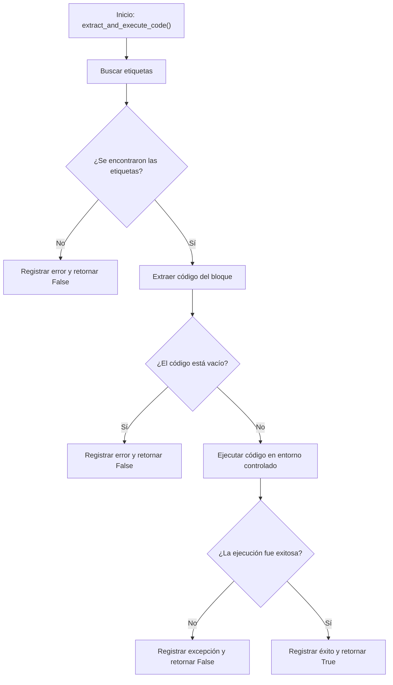

# ⚡ Diagrama de Flujo - executor.py

## Flujo del Ejecutor de Código



## Descripción del Flujo

1. **Inicio**: La función [`extract_and_execute_code()`](../src/executor.py:21) es llamada con la respuesta del LLM y el DataFrame
2. **Buscar etiquetas**: Se utiliza una expresión regular para encontrar el bloque de código entre etiquetas `<execute_python>`
3. **Verificar etiquetas**: Se comprueba si se encontraron las etiquetas en la respuesta
4. **Extraer código**: Se extrae el código del bloque y se eliminan espacios en blanco
5. **Verificar código**: Se comprueba si el código extraído no está vacío
6. **Ejecutar código**: Se ejecuta el código en un entorno controlado con el DataFrame disponible
7. **Verificar ejecución**: Se comprueba si la ejecución fue exitosa
8. **Retornar resultado**: Se devuelve True si la ejecución fue exitosa, False en caso contrario

## Puntos Clave del Diseño

- **Backend no interactivo**: Se configura Matplotlib para usar el backend "Agg" para evitar errores en hilos
- **Extracción segura**: Se utilizan expresiones regulares para extraer el código de forma segura
- **Entorno controlado**: El código se ejecuta en un entorno con solo el DataFrame disponible
- **Manejo robusto de errores**: Se registran todos los errores y excepciones

## Configuración de Matplotlib

El módulo configura Matplotlib para usar un backend no interactivo:

```python
import matplotlib
matplotlib.use("Agg")
```

Esto evita problemas cuando se ejecuta en entornos sin interfaz gráfica o en hilos secundarios.

## Proceso de Extracción de Código

El proceso de extracción utiliza una expresión regular:

```python
match = re.search(r"<execute_python>([\s\S]*?)</execute_python>", llm_response_text)
```

Esta expresión busca:
- `<execute_python>`: Etiqueta de apertura
- `([\s\S]*?)`: Grupo de captura para cualquier carácter (incluyendo saltos de línea) de forma no codiciosa
- `</execute_python>`: Etiqueta de cierre

## Entorno de Ejecución

El código se ejecuta en un entorno controlado:

```python
exec_globals = {"df": df}
exec(code_to_execute, exec_globals)
```

Esto asegura que:
- Solo el DataFrame 'df' está disponible para el código
- No se puede acceder a otras variables del programa
- Se limita el alcance de la ejecución

## Relación con Otros Módulos

El [`executor.py`](../src/executor.py) depende de:

- [`re`](../src/executor.py:13): Para las expresiones regulares de extracción de código
- [`pandas`](../src/executor.py:14): Para el manejo de DataFrames
- [`logging`](../src/executor.py:15): Para el registro de eventos

## Uso del Ejecutor

El ejecutor es utilizado por el workflow principal en [`main.py`](../src/main.py) de la siguiente manera:

```python
v1_success = executor.extract_and_execute_code(code_v1_response, df)
if not v1_success:
    # Manejar error
    pass

v2_success = executor.extract_and_execute_code(code_v2_response, df)
if not v2_success:
    # Manejar error
    pass
```

## Salida Esperada

La función retorna un valor booleano:

- **True**: Si el código se extrajo y ejecutó correctamente
- **False**: Si hubo algún error en el proceso

## Manejo de Errores

El módulo maneja diferentes tipos de errores:

1. **Etiquetas no encontradas**: Si no se encuentran las etiquetas `<execute_python>`
2. **Código vacío**: Si el bloque de código extraído está vacío
3. **Excepciones en ejecución**: Si el código genera alguna excepción al ejecutarse

Todos los errores se registran mediante logging con información detallada sobre el problema.