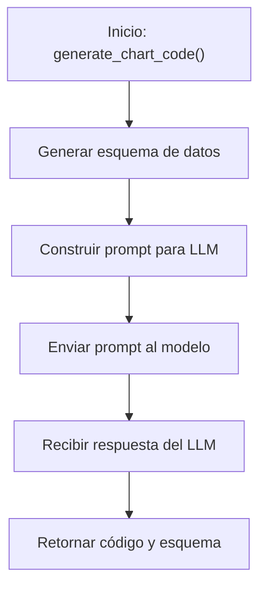

## Flujo del Generator

## Descripción del Flujo

1. **Inicio**: La función [`generate_chart_code()`](../src/generator.py:14) es llamada con una instrucción, modelo, ruta de salida y DataFrame
2. **Generar esquema**: Se utiliza [`utils.make_schema_text()`](../src/utils.py) para crear un esquema dinámico del DataFrame
3. **Construir prompt**: Se crea un prompt detallado con instrucciones específicas para la generación de código
4. **Enviar al modelo**: El prompt se envía al LLM mediante [`utils.get_response()`](../src/utils.py)
5. **Recibir respuesta**: Se obtiene el código Python generado por el modelo
6. **Retornar resultados**: Se devuelve el código generado y el esquema utilizado

