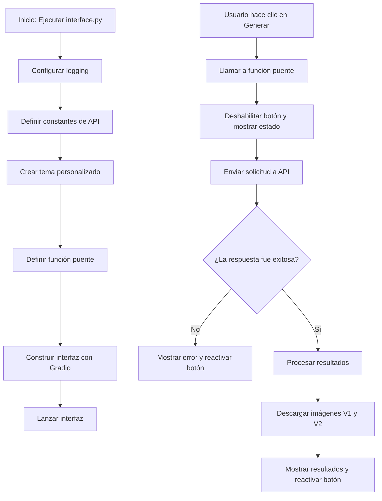

# 🌐 Diagrama de Flujo - interface.py

## Flujo de la Interfaz Gradio



## Descripción del Flujo

### Inicialización de la Interfaz

1. **Inicio**: Se ejecuta el script [`interface.py`](../src/interface.py:1)
2. **Configurar logging**: Se establece el nivel de logging y se silencian loggers de terceros
3. **Definir constantes**: Se configuran las URLs base y endpoint de la API
4. **Crear tema**: Se define un tema oscuro personalizado para la interfaz
5. **Definir función puente**: Se implementa la función que conecta Gradio con la API
6. **Construir interfaz**: Se crea la interfaz de usuario con todos los componentes
7. **Lanzar interfaz**: Se inicia el servidor de Gradio para la interacción del usuario

### Flujo de Generación de Gráficos

1. **Interacción del usuario**: El usuario ingresa una instrucción y hace clic en el botón
2. **Llamar función puente**: Se invoca la función [`llamar_agente_y_mostrar_resultados()`](../src/interface.py:43)
3. **Deshabilitar botón**: Se desactiva el botón para evitar múltiples clics y se muestra estado de procesamiento
4. **Enviar solicitud**: Se envía una solicitud POST a la API con la instrucción del usuario
5. **Verificar respuesta**: Se comprueba si la API respondió correctamente
6. **Procesar resultados**: Se extrae el feedback y las URLs de los gráficos
7. **Descargar imágenes**: Se descargan las imágenes V1 y V2 desde las URLs proporcionadas
8. **Mostrar resultados**: Se muestran las imágenes y el feedback en la interfaz, y se reactiva el botón

## Puntos Clave del Diseño

- **Tema personalizado**: Se utiliza un tema oscuro profesional para mejorar la experiencia visual
- **Función generadora**: La función puente utiliza yield para proporcionar actualizaciones en tiempo real
- **Manejo de estados**: Se gestiona el estado del botón y los mensajes de retroalimentación
- **Descarga de imágenes**: Las imágenes se descargan desde la API y se muestran en la interfaz
- **Logging detallado**: Todas las operaciones importantes se registran para seguimiento

## Tema Personalizado

La interfaz utiliza un tema oscuro personalizado con las siguientes características:

```python
theme = gr.themes.Base(
    primary_hue=gr.themes.colors.blue,
    secondary_hue=gr.themes.colors.sky,
    neutral_hue=gr.themes.colors.gray,
    font=[gr.themes.GoogleFont("Inter"), "ui-sans-serif", "system-ui", "sans-serif"],
).set(
    body_background_fill="*neutral_950",
    body_text_color="*neutral_200",
    background_fill_primary="*neutral_900",
    background_fill_secondary="*neutral_800",
    # ... más configuraciones
)
```

## Función Puente

La función [`llamar_agente_y_mostrar_resultados()`](../src/interface.py:43) actúa como intermediario entre Gradio y la API:

1. **Primer yield**: Deshabilita el botón y muestra mensaje de procesamiento
2. **Llamada a la API**: Envía la instrucción y espera la respuesta
3. **Procesamiento de resultados**: Extrae feedback y URLs de los gráficos
4. **Descarga de imágenes**: Obtiene las imágenes desde las URLs proporcionadas
5. **Segundo yield**: Muestra los resultados finales y reactiva el botón

## Componentes de la Interfaz

La interfaz se compone de los siguientes componentes:

1. **Markdown de título**: Describe el propósito de la aplicación
2. **Sección de entrada**:
   - Campo de texto para la instrucción
   - Botón "Generar y Refinar"
3. **Sección de resultados**:
   - Dos columnas para mostrar los gráficos V1 y V2
   - Componentes de imagen con opción de descarga
4. **Sección de feedback**:
   - Campo de texto para mostrar el análisis del agente
   - Botón de copiado para el feedback

## Relación con Otros Módulos

El [`interface.py`](../src/interface.py) depende de:

- [`gradio`](../src/interface.py:2): Para crear la interfaz de usuario
- [`requests`](../src/interface.py:3): Para comunicarse con la API
- [`PIL.Image`](../src/interface.py:4): Para procesar las imágenes descargadas
- [`io`](../src/interface.py:5): Para manejar los bytes de las imágenes
- [`logging`](../src/interface.py:6): Para el registro de eventos

## Uso de la Interfaz

La interfaz se utiliza de la siguiente manera:

1. **Iniciar la API**: En una terminal, ejecutar `uv run -m fastapi dev src/api.py`
2. **Iniciar la interfaz**: En otra terminal, ejecutar `uv run python src/interface.py`
3. **Acceder a la interfaz**: Abrir http://localhost:7860 en el navegador
4. **Generar gráficos**: Ingresar una instrucción y hacer clic en "Generar y Refinar"

## Manejo de Errores

La interfaz implementa un manejo robusto de errores:

1. **Errores de conexión**: Si la API no está disponible, se muestra un mensaje de error
2. **Errores de descarga**: Si no se pueden descargar las imágenes, se registra el error
3. **Respuestas inválidas**: Si la API retorna una respuesta inválida, se maneja adecuadamente
4. **Logging detallado**: Todos los errores se registran con información de contexto

## Flujo de Datos

1. **Usuario → Interfaz**: El usuario ingresa una instrucción en el campo de texto
2. **Interfaz → API**: La interfaz envía la instrucción a la API mediante una solicitud POST
3. **API → Workflow**: La API ejecuta el workflow y genera los gráficos
4. **Workflow → API**: El workflow retorna los resultados y las URLs de los gráficos
5. **API → Interfaz**: La API envía la respuesta a la interfaz
6. **Interfaz → Usuario**: La interfaz muestra los gráficos y el feedback al usuario