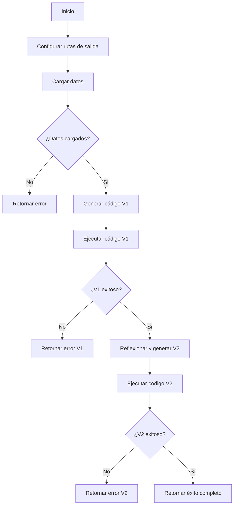

# 🔄 Diagrama de Flujo - main.py

## Flujo del Workflow Principal



## Descripción del Flujo

1. **Inicio**: El workflow comienza con la llamada a [`run_workflow()`](../src/main.py:21)
2. **Configuración de rutas**: Se establecen las rutas para guardar los gráficos V1 y V2
3. **Carga de datos**: Se cargan los datos según la configuración (CSV o MongoDB) usando [`data_processing.load_configured_data()`](../src/data_processing.py)
4. **Verificación de datos**: Si no hay datos, se retorna un error
5. **Generación V1**: Se genera el código inicial para el gráfico usando [`generator.generate_chart_code()`](../src/generator.py)
6. **Ejecución V1**: Se ejecuta el código y se genera el primer gráfico usando [`executor.extract_and_execute_code()`](../src/executor.py)
7. **Verificación V1**: Si falla, se detiene el workflow
8. **Reflexión**: Se analiza el gráfico V1 y se genera feedback + código V2 usando [`reflector.reflect_on_image_and_regenerate()`](../src/reflector.py)
9. **Ejecución V2**: Se ejecuta el código refinado
10. **Verificación V2**: Si falla, se retorna el resultado con V1
11. **Finalización**: Si todo es exitoso, se retorna el resultado completo

## Puntos Clave del Diseño

- **Fail-Fast**: El workflow se detiene si V1 falla
- **Tolerancia a fallos**: Si V2 falla, se puede continuar con V1
- **Pipeline secuencial**: Cada paso depende del anterior
- **Logging detallado**: Cada paso registra su progreso
- **Manejo de errores robusto**: Verificaciones en puntos críticos del flujo

## Estructura de Datos de Retorno

El workflow retorna un diccionario con la siguiente estructura:

```python
{
    "status": "Completed|Error en V1|Error en V2",
    "v1_success": True|False,
    "chart_v1_path": "ruta/al/grafico_v1.png",
    "feedback": "texto del feedback",
    "v2_success": True|False,
    "chart_v2_path": "ruta/al/grafico_v2.png"
}
```

## Relación con Otros Módulos

El [`main.py`](../src/main.py) actúa como orquestador que coordina los siguientes módulos:

- [`config.py`](../src/config.py): Configuración centralizada del sistema
- [`data_processing.py`](../src/data_processing.py): Carga y procesamiento de datos
- [`generator.py`](../src/generator.py): Generación de código inicial
- [`executor.py`](../src/executor.py): Ejecución de código generado
- [`reflector.py`](../src/reflector.py): Análisis y refinamiento de visualizaciones

## Uso del Workflow

El workflow puede ser invocado de varias formas:

1. **Ejecución directa**: `uv run python -m src.main`
2. **Uso programático**: 
   ```python
   from src.main import run_workflow
   results = run_workflow(
       user_instructions="instrucciones",
       generation_model="modelo",
       reflection_model="modelo"
   )
   ```
3. **A través de la API**: Via el endpoint `/generate-chart/` en [`api.py`](../src/api.py)
4. **Interfaz web**: A través de la interfaz Gradio en [`interface.py`](../src/interface.py)