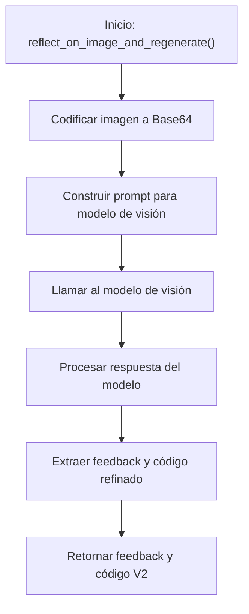

# 🔍 Diagrama de Flujo - reflector.py

## Flujo del Reflector de Código



## Descripción del Flujo

1. **Inicio**: La función [`reflect_on_image_and_regenerate()`](../src/reflector.py:10) es llamada con la ruta del gráfico, instrucción, modelo, ruta de salida, código V1 y esquema
2. **Codificar imagen**: Se utiliza [`utils.encode_image_b64()`](../src/utils.py) para convertir la imagen del gráfico V1 a formato Base64
3. **Construir prompt**: Se crea un prompt detallado con instrucciones para el análisis y refinamiento
4. **Llamar al modelo**: El prompt se envía al modelo de visión mediante [`utils.image_openai_call()`](../src/utils.py)
5. **Procesar respuesta**: Se recibe y procesa la respuesta del modelo
6. **Extraer feedback y código**: Se utiliza [`utils.parse_reflector_response()`](../src/utils.py) para separar el feedback del código
7. **Retornar resultados**: Se devuelve el feedback en español y el código refinado para V2

## Puntos Clave del Diseño

- **Análisis visual**: El modelo de visión analiza la imagen del gráfico V1
- **Feedback en español**: Se requiere explícitamente que el feedback esté en español
- **Formato estructurado**: La respuesta debe incluir un JSON con feedback y código envuelto en etiquetas
- **Restricciones claras**: El prompt especifica restricciones técnicas para el código refinado

## Detalles del Prompt

El prompt construido incluye:

1. **Instrucciones claras**: Se especifica que se es un experto en visualización de datos
2. **Formato de respuesta**: Se requiere un JSON con feedback y código envuelto en etiquetas específicas
3. **Contexto completo**: Se incluye el código original y el esquema de datos
4. **Restricciones técnicas**:
   - Usar estilos matplotlib integrados (no seaborn)
   - Usar solo pandas/matplotlib
   - Asumir que el DataFrame 'df' ya existe
   - Guardar con dpi=300
   - Siempre llamar a plt.close()
   - Incluir todas las importaciones necesarias

## Relación con Otros Módulos

El [`reflector.py`](../src/reflector.py) depende de:

- [`utils.py`](../src/utils.py): Para codificar la imagen, comunicarse con la API y procesar la respuesta
- [`logging`](../src/reflector.py:7): Para el registro de eventos

## Uso del Reflector

El reflector es utilizado por el workflow principal en [`main.py`](../src/main.py) de la siguiente manera:

```python
feedback, code_v2_response = reflector.reflect_on_image_and_regenerate(
    chart_path=out_path_v1,
    instruction=user_instructions,
    model_name=reflection_model,
    out_path_v2=out_path_v2,
    code_v1=code_v1_response,
    schema=schema,
)
```

## Salida Esperada

La función retorna una tupla con dos elementos:

1. **Feedback**: String en español con el análisis crítico del gráfico V1
2. **Código refinado**: String con el código Python mejorado para generar el gráfico V2

## Manejo de Errores

El módulo delega el manejo de errores a las funciones de utilidad:
- Codificación de imagen
- Comunicación con la API
- Procesamiento de la respuesta

Los errores se manejan a nivel del llamador (main.py) si la respuesta del modelo no es válida.