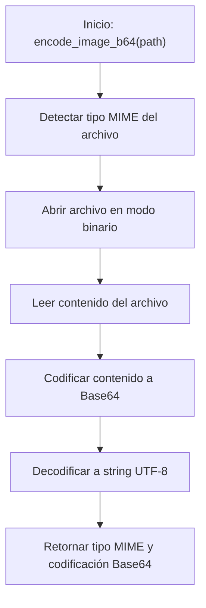

# 🛠️ Diagrama de Flujo - utils.py: encode_image_b64()

## Flujo de la Función encode_image_b64()

## Descripción del Flujo

1. **Inicio**: Se llama a la función [`encode_image_b64()`](../src/utils.py:71) con la ruta de una imagen
2. **Detectar tipo MIME**: Se utiliza la librería mimetypes para determinar el tipo MIME del archivo
3. **Abrir archivo**: Se abre el archivo de imagen en modo binario para lectura
4. **Leer contenido**: Se lee todo el contenido binario del archivo
5. **Codificar a Base64**: Se codifica el contenido binario a formato Base64
6. **Decodificar a UTF-8**: Se decodifica el resultado Base64 a una cadena UTF-8
7. **Retornar resultado**: Se devuelve el tipo MIME detectado y la cadena Base64