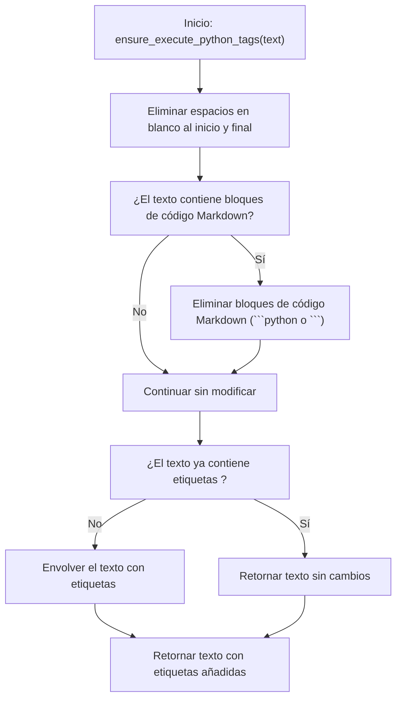

# 🛠️ Diagrama de Flujo - utils.py: ensure_execute_python_tags()

## Flujo de la Función ensure_execute_python_tags()



## Descripción del Flujo

1. **Inicio**: Se llama a la función [`ensure_execute_python_tags()`](../src/utils.py:88) con un texto que contiene código Python
2. **Limpiar texto**: Se eliminan los espacios en blanco al inicio y final del texto
3. **¿Contiene bloques Markdown?**: Se verifica si el texto contiene bloques de código Markdown (```python o ```)
4. **Eliminar bloques Markdown**: Si se encuentran bloques de código Markdown, se eliminan
5. **¿Tiene etiquetas <execute_python>?**: Se verifica si el texto ya contiene las etiquetas `<execute_python>`
6. **Añadir etiquetas**: Si no tiene las etiquetas, se envuelve el texto con `<execute_python>` al inicio y `</execute_python>` al final
7. **Retornar resultado**: Se devuelve el texto procesado con las etiquetas adecuadas

## Notas
- La función utiliza expresiones regulares para detectar y eliminar bloques de código Markdown
- Si el texto ya contiene las etiquetas `<execute_python>`, no se modifica
- La función garantiza que el código Python esté siempre envuelto en las etiquetas correctas para su ejecución