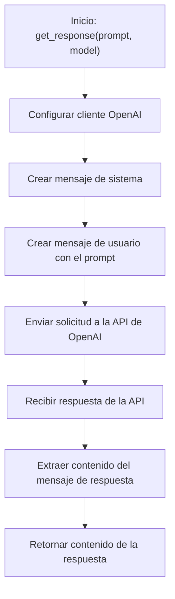

# 🛠️ Diagrama de Flujo - utils.py: get_response()

## Flujo de la Función get_response()

## Descripción del Flujo

1. **Inicio**: Se llama a la función [`get_response()`](../src/utils.py:35) con un prompt y un modelo
2. **Configurar cliente**: Se inicializa el cliente de OpenAI con la clave de API desde la configuración
3. **Crear mensaje de sistema**: Se prepara un mensaje de sistema para establecer el contexto
4. **Crear mensaje de usuario**: Se crea un mensaje de usuario con el prompt proporcionado
5. **Enviar solicitud**: Se envía la solicitud a la API de OpenAI con los mensajes y el modelo especificado
6. **Recibir respuesta**: Se recibe la respuesta de la API de OpenAI
7. **Extraer contenido**: Se extrae el contenido del mensaje de respuesta
8. **Retornar resultado**: Se devuelve el contenido de la respuesta como texto

## Notas
- La función utiliza la librería `openai` para interactuar con la API
- El modelo se puede especificar como parámetro, permitiendo flexibilidad
- La función maneja la configuración de la API de forma automática
- El mensaje de sistema ayuda a establecer el contexto para la respuesta