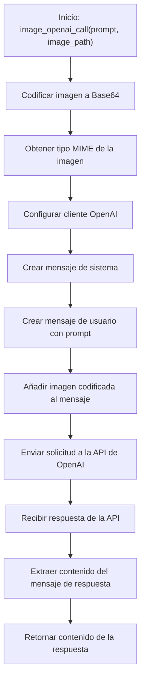

# 🛠️ Diagrama de Flujo - utils.py: image_openai_call()

## Flujo de la Función image_openai_call()

## Descripción del Flujo

1. **Inicio**: Se llama a la función [`image_openai_call()`](../src/utils.py:53) con un prompt y la ruta de una imagen
2. **Codificar imagen**: Se utiliza la función `encode_image_b64()` para codificar la imagen a Base64
3. **Obtener tipo MIME**: Se obtiene el tipo MIME de la imagen (ej: "image/png")
4. **Configurar cliente**: Se inicializa el cliente de OpenAI con la clave de API desde la configuración
5. **Crear mensaje de sistema**: Se prepara un mensaje de sistema para establecer el contexto
6. **Crear mensaje de usuario**: Se crea un mensaje de usuario con el prompt proporcionado
7. **Añadir imagen**: Se añade la imagen codificada en Base64 al mensaje de usuario
8. **Enviar solicitud**: Se envía la solicitud a la API de OpenAI con los mensajes, incluyendo la imagen
9. **Recibir respuesta**: Se recibe la respuesta de la API de OpenAI
10. **Extraer contenido**: Se extrae el contenido del mensaje de respuesta
11. **Retornar resultado**: Se devuelve el contenido de la respuesta como texto

## Notas
- La función utiliza la librería `openai` para interactuar con la API
- La imagen se codifica en Base64 para poder ser enviada a la API
- El formato de la imagen en la API sigue la estructura: `data:{mime_type};base64,{encoded_image}`
- La función permite analizar imágenes junto con prompts de texto
- El modelo utilizado está configurado para procesar tanto texto como imágenes