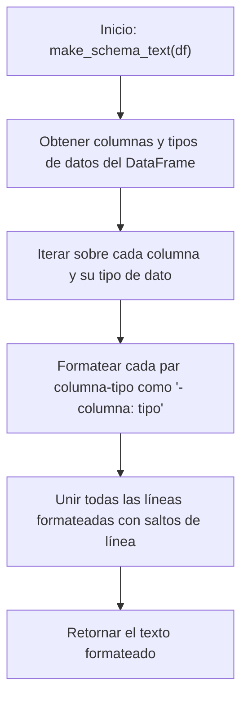

# 🛠️ Diagrama de Flujo - utils.py: make_schema_text()

## Flujo de la Función make_schema_text()

## Descripción del Flujo

1. **Inicio**: Se llama a la función [`make_schema_text()`](../src/utils.py:108) con un DataFrame de pandas
2. **Obtener información**: Se obtiene la información de columnas y tipos de datos del DataFrame mediante `df.dtypes.items()`
3. **Iterar**: Se itera sobre cada par columna-tipo de dato del DataFrame
4. **Formatear**: Cada par columna-tipo se formatea como una línea de texto con el formato "- columna: tipo"
5. **Unir líneas**: Todas las líneas formateadas se unen en un solo texto separado por saltos de línea
6. **Retornar resultado**: Se devuelve el texto formateado que describe el esquema del DataFrame

## Notas
- La función crea una representación legible por humanos del esquema de un DataFrame
- El formato de salida es una lista con viñetas donde cada elemento representa una columna y su tipo de dato
- Esta función es útil para generar descripciones de datos que pueden ser utilizadas en prompts o documentación