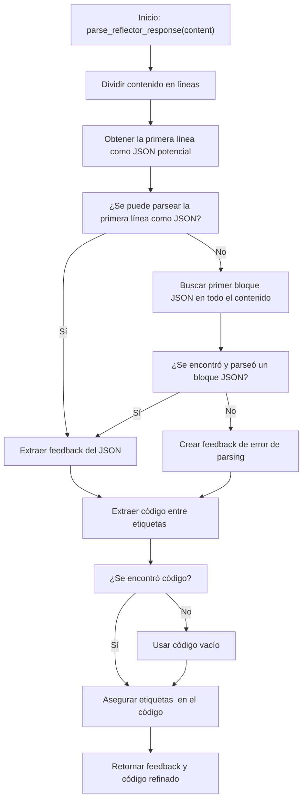

# 🛠️ Diagrama de Flujo - utils.py: parse_reflector_response()

## Flujo de la Función parse_reflector_response()

## Descripción del Flujo

1. **Inicio**: Se llama a la función [`parse_reflector_response()`](../src/utils.py:122) con el contenido de respuesta del agente reflector
2. **Dividir contenido**: Se divide el contenido en líneas individuales
3. **Obtener primera línea**: Se toma la primera línea como un potencial JSON
4. **¿Se puede parsear JSON?**: Se intenta parsear la primera línea como JSON
5. **Extraer feedback**: Si el parsing es exitoso, se extrae el feedback del objeto JSON
6. **Buscar bloque JSON**: Si falla el parsing de la primera línea, se busca el primer bloque JSON en todo el contenido
7. **¿Se encontró JSON?**: Se verifica si se encontró y parseó correctamente un bloque JSON
8. **Crear error**: Si no se encuentra JSON válido, se crea un feedback de error
9. **Extraer código**: Se busca y extrae el código contenido entre las etiquetas `<execute_python>` y `</execute_python>`
10. **¿Se encontró código?**: Se verifica si se encontró código entre las etiquetas
11. **Asegurar etiquetas**: Si se encontró código, se aseguran las etiquetas `<execute_python>` usando la función `ensure_execute_python_tags()`
12. **Usar código vacío**: Si no se encontró código, se utiliza una cadena vacía
13. **Retornar resultado**: Se devuelve una tupla con el feedback y el código refinado

## Notas
- La función maneja errores de parsing JSON de forma robusta, con múltiples estrategias
- El código se extrae específicamente de las etiquetas `<execute_python>`, ignorando otro contenido
- La función garantiza que el código devuelto siempre tenga las etiquetas adecuadas
- El feedback se extrae preferentemente de un objeto JSON estructurado